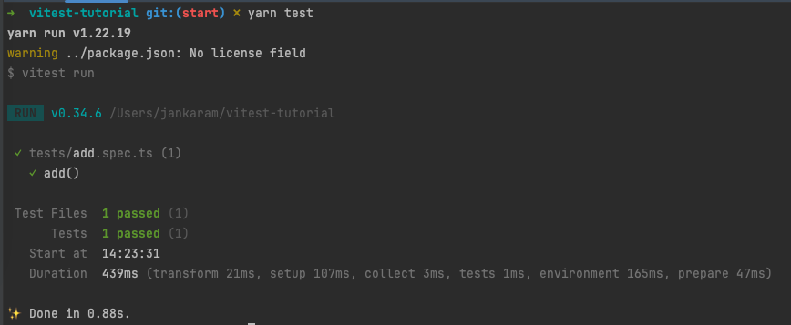

# Getting started with unit testing in JS/TS and React

## What is unit testing?

Unit testing is a software development process in which the smallest testable parts of an application, called units, are individually and independently tested. The goal is to verify that each unit of code meets its design and behaves as expected. 
In simpler terms unit testing is isolating the smallest sets of code and testing them to verify that they behave as expected.

## What you need to get started?

1. a testing framework like Vitest or Jest (personally I prefer vitest).
2. a project to test. I provided a repo to get started with at [here](https://github.com/JanKaram2020/vitest-tutorial) but you can start with any project

## Why Vitest not Jest ?
1. It's significantly faster than Jest.
2. Out-of-box ESM, TypeScript and JSX support powered by esbuild.
3. In watch mode it's smart and only reruns the related changes, just like HMR for tests!
4. If you know Jest you already know Vitest, it provides a Jest compatible API that allows you to use it as a drop-in replacement in most projects.  you only have to change a few things, and you're good to go. check the migration guide [here](https://vitest.dev/guide/migration.html#migrating-from-jest)

## Installing vitest in your project

    yarn add -D vitest vite @vitejs/plugin-react react-test-renderer @testing-library/react @testing-library/jest-dom jsdom 

you can ignore `@vitejs/plugin-react react-test-renderer @testing-library/react @testing-library/jest-dom` if you won't test react
and if you use typescript paths (absolute imports) add `vite-tsconfig-paths`
## Configuring vitest

### Make a file in the root of the project called `vitest.config.ts` with the following code

    import { defineConfig } from 'vitest/config';  
    import react from '@vitejs/plugin-react';  
    import tsconfigPaths from 'vite-tsconfig-paths';  
    
    export default defineConfig({  
      plugins: [tsconfigPaths(), react()],  
      test: { 
       environment: 'jsdom',
       setupFiles: ['./tests/setupTests.ts'],  
      },  
    });
`@vitejs/plugin-react` enables HMR for react in development.
`vite-tsconfig-paths` makes vite use the paths defined in your tsconfig.
`environment: 'jsdom'` by default the environment is `node` which means that any code meant for the browser can't run in the test, so we use jsdom which provides a browser like environment to run the test in it.

### and `tests/setupTests.ts`    with the following code

    import '@testing-library/jest-dom/vitest';  
    import { afterEach } from 'vitest';  
    import { cleanup } from '@testing-library/react';
    
    afterEach(() => {  
      cleanup();  
    });

> [The `@testing-library/jest-dom/vitest` library provides a set of custom jest/vitest matchers that you can use to extend jest/vitest. These will make your tests more declarative, clear to read and to maintain.](https://www.npmjs.com/package/@testing-library/jest-dom#:~:text=The%20@testing-library/jest-dom%20library%20provides%20a%20set%20of%20custom%20jest%20matchers%20that%20you%20can%20use%20to%20extend%20jest.%20These%20will%20make%20your%20tests%20more%20declarative,%20clear%20to%20read%20and%20to%20maintain.)

the after each cleanup configures vitest and @testing-library/react to clean up after running every test so that each test can run on a clean slate
### and the following script to your `package.json`

     "test": "vitest run",

## Writing our first test
let's start with something simple
create a file called  `tests/add.ts` with the following code

    export const add = (a:number, b:number) => a + b;
to test a unit is to check whether it matches something   
eg: you expect 1 + 2 = 3. this is human language  
in TS/JS you write `expect(1+2).toEqual(3)`  
there are a lot of matchers for a different types  
eg: `expect(function).toHaveBeenCalled()`  
eg: `expect(object).toHaveProperty(property)`  
eg: `expect(array).toContain(element)`  
eg: `expect(boolean).not.toBe(false)`  

to create a test file you must use the extension ".spec.(ts/tsx/js/jsx)" or ".test.(ts/tsx/js/jsx)"
a spec comes from "specification" where you specify how code should behave, the extension doesn't change anything in how we write the tests it's just a prefrence.
so create a file in the same folder you created the add file called `add.test.ts` with the following code

    import {add} from  './add';
    import { expect, test } from  'vitest'
    
    test("add()" , () => {
	    expect(add(1,2)).toBe(3);
    })

then fire up the terminal and run `yarn test`
your terminal should look like this  

congratulations! you just ran your first test successfully.
